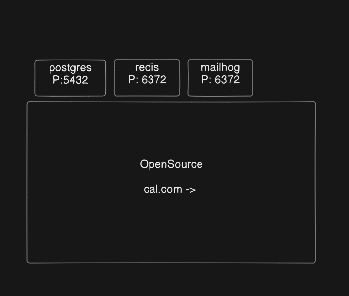

# Docker Basics

## Problem statement

**How can we build, ship, and run applications consistently across different environments?**
There was a big issue faced by most developers whenever they created any code that code was working on that developer computer, but when they try to run that particular code on the server, that code was not working. This happened because apps need the right environment to run (like the right OS, libraries, and settings). If something was different on your computer vs. the server, things would break.

### Real-World Issues Before Docker

1. Environment Mismatch - Code works on a developer’s machine but fails in production.
2. Complex Deployments - Manually installing dependencies and configurations on servers.
3. Dependency Conflicts - Running multiple apps with conflicting libraries on the same system.

## What is Docker?

Docker is a tool that simplifies the process of developing, packaging, and deploying applications.It basically creates a replica of environment to run the application. Docker is an open-source containerization platform by which you can pack your application and all its dependencies into a standardized unit called a container.

Containers are light in weight, which makes them portable, and they are isolated from the underlying infrastructure and from each other's container. By using containers, Docker containers minimize the time between writing code and deploying it into production.

Demon handles all the task in docker. Such as creating a image, creating containers etc.

docker run -it ubuntu (run docker to run ubuntu, it will create a image and run the container). first check if ubuntu image is already existing. if it doesnot exist It downloads image from hub.docker.com
it will redirect to a terminal which will be running inside container wh8ich will be seaperate from outside env.

## Images and Containers

An **image** is just like an operating system, and **containers** are like machines. Images run inside containers.

Take the example of a MacBook and macOS: macOS runs inside a MacBook. Similarly, one image can run in multiple containers, and all containers are isolated from each other.

We can also create our own custom images like `ubuntu-with-tools` and publish these images to [hub.docker.com](https://hub.docker.com). Then we can run these images inside containers and on our AWS cloud platforms.

---

  


---

### Common Docker Commands

```bash
docker container ls           # Show all running containers
docker container ls -a        # Show all existing containers (including stopped)
docker start container_name   # Start a stopped container
docker stop container_name    # Stop a running container

docker run -it <image_name>   # Spin up the image in an interactive terminal
docker exec <container_name> <command>  # Execute command inside container
docker exec -it container_name bash     # Connect to container shell
docker run -it --name <container_name> <image_name> # Spin th image inside container by creating container.
```

> `-it` stands for interactive terminal; it connects your terminal to the Docker container

---

## Port Mapping

The problem is that when a Docker container is running on some port, it is **not accessible outside the container** (i.e., localhost won't see it).

To expose the container's port to your local machine, we use the `-p` flag.

```bash
docker run -it -p <machine_port>:<container_port> image_name
```

You can also pass environment variables to the Docker container using `-e`:

```bash
docker run -it -p <machine_port>:<container_port> \
  -e <key>=<value> \
  -e <key>=<value> \
  image_name
```

---


---

## Docker Compose

In real-world scenarios, we may need to use multiple containers, and each container will be running on its own port. Docker Compose helps manage all the multiple container requirements.

We can create a `docker-compose.yml` file to manage them:

---



---

### docker-compose.yml

```yaml
version: "3.8"

services:
  postgres:
    image: postgres # hub.docker.com
    ports:
      - "5432:5432"
    environment:
      POSTGRES_USER: postgres
      POSTGRES_DB: review
      POSTGRES_PASSWORD: password

  redis:
    image: redis
    ports:
      - "6379:6379"
```

---

### Common Commands

```bash
docker compose up          # Start all services
docker compose down        # Stop and remove all containers
sudo docker compose up -d  # Detached mode (runs in background)
```
