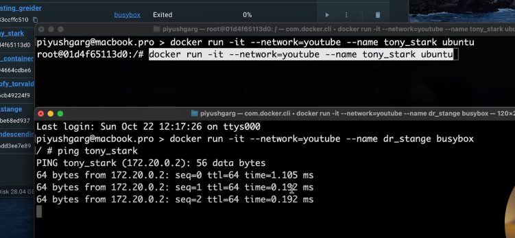

# Intermediate Docker

---

## Docker Networking

Docker's networking subsystem is pluggable using drivers. It connects containers with your host machine through these drivers. There are 3 most commonly used drivers: `bridge`, `host`, and `none`.

- `bridge`: Default driver used when any container is run.
- `host`: Directly connects container to the host machine.
- `none`: Used to block all external connections.

---

### Useful Commands

```bash
docker network inspect bridge   # Show all details of the 'bridge' network
docker network ls              # List all networks with their drivers
docker run -it --network=host <image_name>  # Connect container to host network
```

> Difference between bridge and host: With `bridge`, we need to expose ports explicitly. With `host`, no need to expose ports.

You can also create a custom network to allow communication between containers:

```bash
docker network create -d bridge youtube
docker network ls
docker run -it --network=youtube --name tony_stark ubuntu
```

---



---

## Volume Mounting

Each container has its own memory. When it is destroyed, the memory is erased. To prevent this, Docker volumes are used. Volumes allow data persistence even after container deletion.

```bash
docker run -it -v <host_machine_path>:<container_path> image
```

> Any changes made on either side (host/container) will reflect on the other side.

This ensures we can preserve the memory of containers and resume from where we left off.

You can also create your own custom volume.

---


---

## Efficient Caching in Layers

Each line in a Dockerfile is a **layer**. Docker caches these layers.

If a line in the Dockerfile changes, **all layers below it are re-executed**. Hence, the order of layers impacts build time.

> For better performance, keep `npm install` above the file copy instructions. This way, unless `package.json` changes, Docker will skip re-running `npm install`.

You can also create a `.dockerignore` file (like `.gitignore`) to exclude files during `COPY`.

---

## Docker Multistage Builds

Docker allows defining **multiple build stages**, such as a **build stage** and a **runner stage**, to reduce final image size and separate concerns.

You can also define a default working directory:

```Dockerfile
WORKDIR /app
```

This sets the directory where all operations will be executed inside the container.
